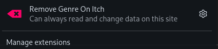
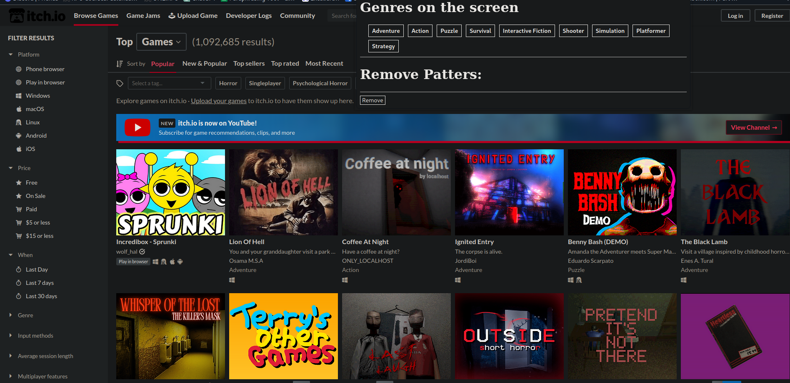

# itch-exclude-genre

looks though all the genres on the page, lists them and let's you remove elements on the page based on the list.

Made this becase there is no default way to have Negative tags / Tag exclusion on itch

# installation

# Demo screenshots

then

